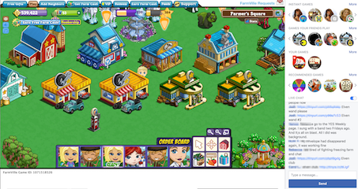
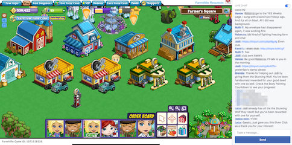

| before Chat Charger | after |
| -------      | --------      |
|||
|game recommendations so big|💜🌸 _Live Chat is tall._ 🌻💛|

## short installation instructions

Drag the link below to your bookmark bar:

LINK --&gt;&gt; <a style="font-size: 175%;" href="javascript:
(function() {
  var styleElement = document.createElement('style');
  document.head.appendChild(styleElement);
  var styleSheet = styleElement.sheet;
  styleSheet.insertRule(
    '._3ss {display: none;}'
  );
  styleSheet.insertRule(
    '.uiScrollableAreaWrap { max-height: 540px !important; }'
  );
  console.log('Chat Charger version 2.1 loaded. More at ChatCharger.org');
})();
"> Chat Charger</a> &lt;&lt;-- LINK

Then load Farmville, then click the Chat Charger button.
Please follow the detailed instructions below carefully if
Chat Charger is not working for you.
<br>


## detailed installation instructions

1. Close the Farmville window.
1. Drag the **Chat Charger** link above to your bookmarks bar.
  * NOTE: Don't click the link. That does nothing. Drag it.
  * If that doesn't make sense, watch this [tutorial video](https://www.youtube.com/watch?v=-E6h7Z5fPlg) that demonstrates the dragging process.
1. Open Farmville.
1. Click the **Chat Charger** bookmark in your bookmarks bar.
1. Super Tall Chat yay!


## details
Chat Charger gets rid of the game recommendations and makes the
Live Chat window taller. Is this magic or dangerous? No.
The bookmark you click changes two display properties. If you're
concerned, have a computer friend review the technical details
and code below.


## not happy?

If Chat Charger doesn't work or you don't like it:

* The effects of Chat Charger are erased every time you reload the Farmville page or restart your browser. Chat Charger has no effect unless you click the bookmark.
* Remove the bookmark from your bookmarks bar. Right click on the
**Chat Charger** bookmark in your bookmark bar, then choose Delete.
* Refresh your browser page to get a fresh copy.
* Please [write to me](mailto:ChatCharger@gmail.com) and let me know what happened. I need your feedback to make things better.

Has **Chat Charger** stopped working? It's possible that Facebook has
changed something. Please
[let me know](mailto:ChatCharger@gmail.com)
and I'll try to fix it.


## future features

If you have suggestions for improving these instructions or
Chat Charger, please let me know at:
[ChatCharger@gmail.com](mailto:ChatCharger@gmail.com).

Chat Charger cannot change the function of the Live Chat
window, but it could change display options like fonts, colors,
text sizes. Long range options might include shortening long
links, hiding messages from bots, and a
<button name="dingbutton" onclick="
new Audio('http://thecyberbuddy.com/sounds/samtwitch.wav').play();
">sound</button>
when someone mentions your name.


## technical details & code
The Chat Charger bookmarklet adds two CSS declarations:

`._3ss {display: none;}`
> hide the game recommendations at top right.

`.uiScrollableAreaWrap {max-height: 540px !important;}`
> expand Live Chat to fill the space vacated by the game recommendations.

This bookmarklet is designed for the Farmville game page.
Please don't use it on other pages. If you do so by
accident, reload the page and any effects of the
bookmarklet will be banished.

### code
You can edit the bookmark to inspect its contents
for anything nefarious. Copy the code to a code editor for
to make it easier to read. Right click on the Chat Charger bookmark
in your bookmark bar and click "Edit" to see the code. Most browsers
display the code with the label "URL".

Here's a copy of the code from the bookmarklet. The comments are not
included in the bookmarklet since they
[interfere](https://github.com/slothbear/chatcharger/issues/11)
with operation.

```javascript
(function() {
  var styleElement = document.createElement('style');
  document.head.appendChild(styleElement);
  var styleSheet = styleElement.sheet;
  // Remove the game recommendation sections.
  styleSheet.insertRule(
    '._3ss {display: none;}'
  );
  // Make the Live Chat window taller.
  styleSheet.insertRule(
    '.uiScrollableAreaWrap { max-height: 540px !important; }'
  );
  console.log('Chat Charger version 2.1 loaded. More at ChatCharger.org');
})();
```

### origin

Over time, Facebook/Farmville added more lines of game recommendations
in the right column, leaving less space for Live Chat. At this time,
the recommendations take about 1/2 the column. I never use those
recommendations so I'd really rather have more lines in Live Chat.

For some time I had a Greasemonkey/Tampermonkey script that modified the
CSS properties. This worked well for me as I'm a heavy Greasemonkey user
and a tech nerd – but it seemed much too complicated for distribution to
your average Farmer.

I remembered that a bookmarklet could change CSS, is much easier to install,
and doesn't tamper with your system like Greasemonkey does. So I coded two
CSS declarations, bought a domain, and wrote these words. Give it a try and
[let me know](mailto:ChatCharger@gmail.com) your thoughts. Thanks!
