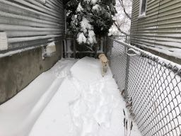

## Farmville Live Chat Window Too Small!

#### before:


* Drag the link below (labeled "LCmax") to your bookmark bar (or anywhere in your
bookmarks).
  * <a href="javascript:alert('Farmville Live Chat Max is under construction.');">LCmax</a>
* Open Farmville (and wait for it to settle in).
* Click the **LCmax** bookmark in your bookmarks bar.


#### after:


### code
You can edit the bookmark before you use it and inspect its contents
to see that it doesn't do anything nefarious. You'll probably want
to copy the next to a code editor for reformatting to make it easier
to read. I've included a formatted copy of the code below.

```javascript
alert(
  'Farmville Live Chat Max is under construction.'
  );
```

### technical details

Facebook displays lots of suggestions above the Farmville "Live Chat"
window, making the chat window quite short and difficult to use.

This browser bookmarklet inserts two CSS rules into the page:

* Hide the game recommendation section at the top of the right column.
* Change the size of the Live Chat window to take up most of the right column.

The CSS declarations use these class names from the page:

* .3ss (game recommendations)
* .uiScrollableAreaWrap (Live Chat)

The code in the bookmarklet is structured to make it as easy as
possible for a novice to understand (and change?). Most will not
change the bookmarklet but it is important to be as transparent
as possible regarding the actions taken since the user is trusting
the button to do stuff on their computer.

This bookmarklet is designed for the Farmville game page.
Please don't use it on other pages. If you do so by
accident, reload the page and all effects of the
bookmarklet will be banished.
